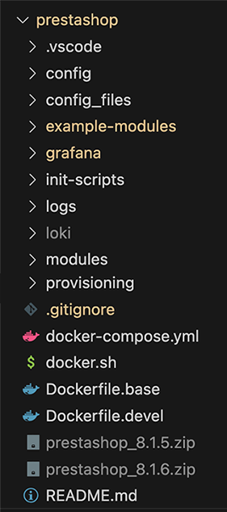

# PrestaShop Development Environment

This repository provides a complete setup for a PrestaShop development environment using Docker. The setup includes multiple components including MySQL, PrestaShop, Loki, Promtail, and Grafana for log analysis.

## Demo

[](https://youtu.be/-I7AREvHALY)

At the end, when everything is running you should have this:



## Prerequisites

- Ensure you have Docker and Docker Compose installed on your machine.
- Download a version of Prestashop
- Create necessery folders for Grafana, Loki,...

## Setup Instructions

### Building the Base and Development Containers

1. Clone this repository.
2. Customize `Dockerfile.devel` to install a different version of PrestaShop or other dependencies if needed.
3. Build the Docker images using the provided `docker.sh` script:

   ```sh
   ./docker.sh build
   ```

### Running the Development Environment

1. Start the development environment:

   ```sh
   ./docker.sh up
   ```

### SSH Access to the Base Container

The base container is set up with OpenSSH server and allows SSH access using public key authentication. Ensure your public key is added to the container.

## Configuration Details

### Dockerfile.base

This Dockerfile sets up the base container with all necessary dependencies and tools except PrestaShop. It includes configurations for PHP, SSH, and other essential tools.

### Dockerfile.devel

This Dockerfile sets up the development container, adding PrestaShop and other necessary configurations for a development environment.

### docker-compose.yml

This file defines the services and configurations for Docker Compose, including the PrestaShop service, MySQL database, Loki, Promtail, and Grafana for log analysis.

## Log Analysis with Grafana and Loki

This setup includes Grafana for visualizing logs and Loki as a log aggregation system. Promtail is used to collect logs from various sources.

### Services

- **MySQL**: Database service for PrestaShop.
- **PrestaShop**: The main application service.
- **Loki**: A log aggregation system.
- **Promtail**: An agent that ships the contents of the logs to Loki.
- **Grafana**: A platform for monitoring and observability.

### Grafana Setup

1. Grafana is available at `http://localhost:3000`.
2. Default authentication is disabled, and anonymous access is enabled with Admin role. You can customize this in the `docker-compose.yml` file if needed.
3. Logs from Apache and PrestaShop are collected and displayed in Grafana dashboards.

### Configuration Files

- **loki-config.yaml**: Configuration for Loki.
- **promtail-config.yml**: Configuration for Promtail to specify which logs to collect and ship to Loki.

### Starting the Log Analysis Stack

1. Start the stack using Docker Compose:

   ```sh
   docker-compose up -d
   ```

2. Access Grafana at `http://localhost:3000` to start visualizing your logs.

### Directory Structure

- `config_files/`: Contains configuration files for MySQL and other services.
- `init-scripts/`: Initialization scripts for setting up the environment.
- `logs/`: Directory to store logs from Apache and PrestaShop.
- `modules/`: Custom PrestaShop modules for development.
- `grafana/`: Persistent storage for Grafana configurations and dashboards.
- `provisioning/`: Grafana provisioning configuration for data sources and dashboards.

### Example Commands

To build and run the Docker containers:

```sh
./docker.sh build
./docker.sh up
```

## Notes

- Ensure your public SSH key is correctly added to the configuration for SSH access.
- Adjust any environment variables as necessary in the `docker-compose.yml` file.

## Useful Links

- [PHP Remote Debugging with VSCode](https://ramyhakam.medium.com/php-remote-debugging-with-vscode-a-comprehensive-guide-f20e67000b7d)
- [PrestaShop Console Commands](https://github.com/nenes25/prestashop_console/blob/1.7/COMMANDS.md)
- [Module Bootstrap](https://github.com/friends-of-presta/demo-cqrs-hooks-usage-module)
- [Logio](http://logio.org/)
- [Creating Console Commands in PrestaShop 1.7](https://webkul.com/blog/create-your-own-console-command-in-prestashop-1-7/)
